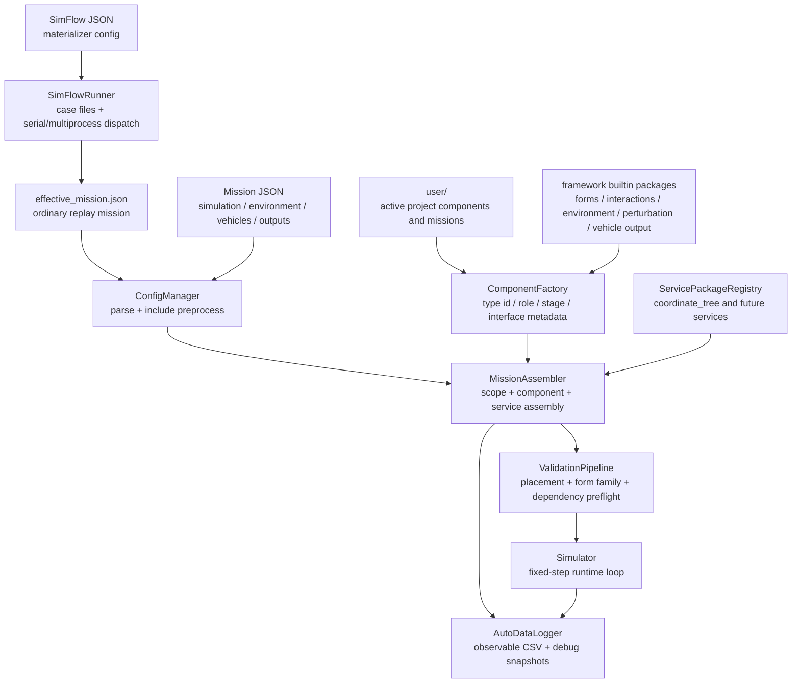
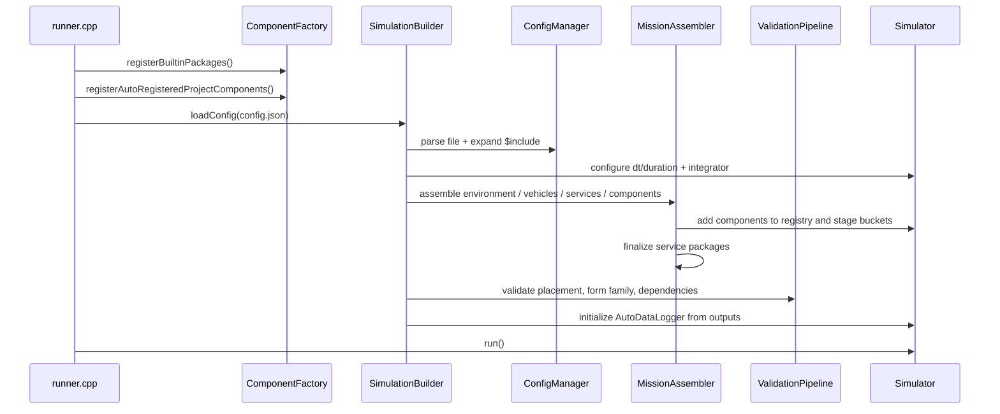
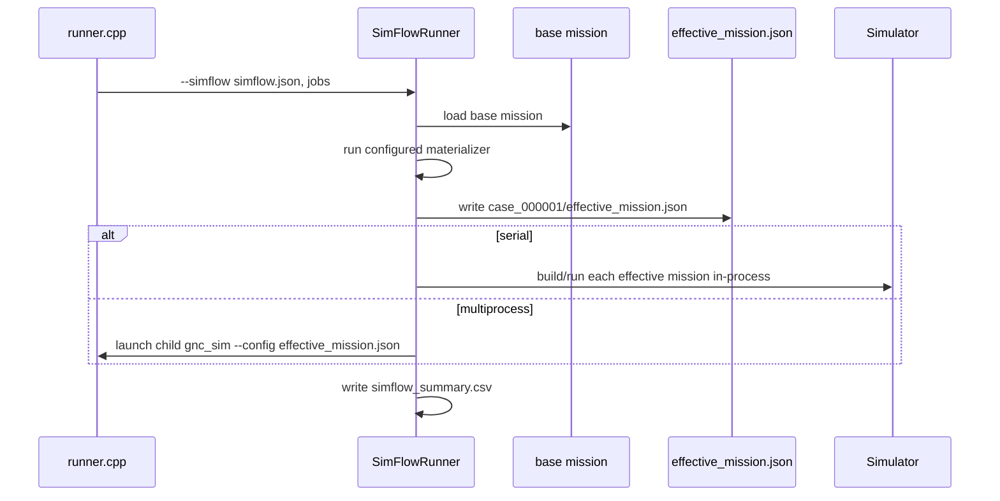
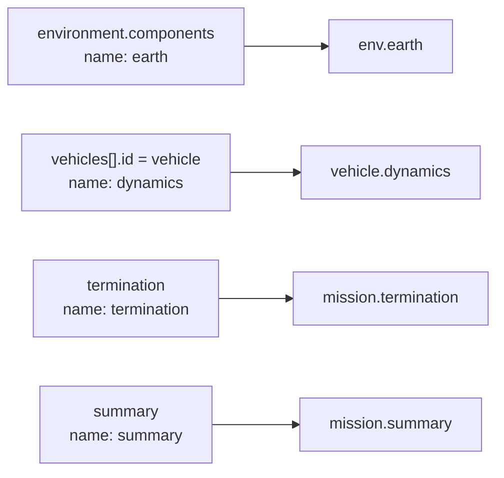
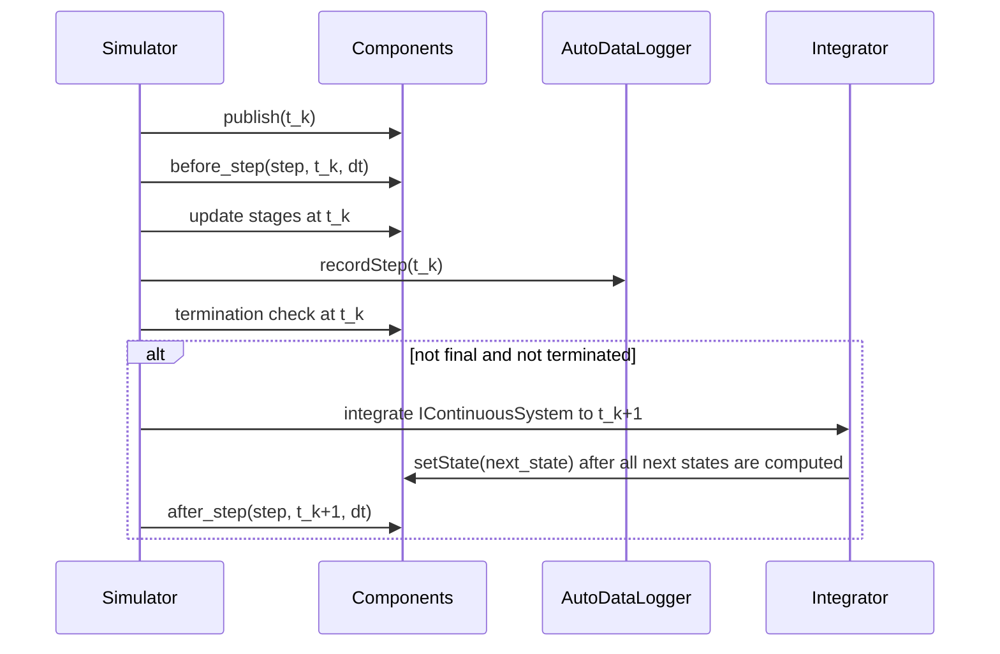
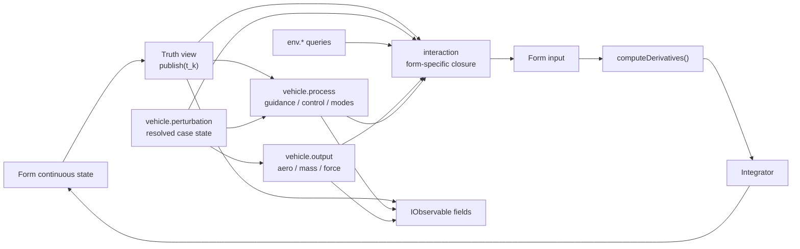

# 当前架构总览

GNCZMKN 当前是显式装配的固定步长仿真框架。mission 使用顶层 `vehicles[]` 描述广义飞行器实体；每个实体拥有自己的 `form/services/perturbation/common/input/process/output/interaction` 块，并注册到 `<id>.<name>` 作用域。

单次仿真直接运行 mission。批量或参数化仿真通过 SimFlow 先生成每个 case 的 `effective_mission.json`，再把每个 effective mission 当作普通 mission 运行。因此 SimFlow 是仿真前置物化和调度层，不改变 `Simulator` 对单次 mission 的运行语义。

旧式 `entities[]`、根级 `components/services`、根级 `form/vehicle/interaction` 会被运行时拒绝。想先理解概念边界，先读 [02-core-concepts.md](02-core-concepts.md)；想看源码细节，再读 [05-architecture.md](05-architecture.md)。

## 架构地图



核心关系是：mission 不直接创建 C++ 对象；它只引用 `ComponentFactory` 中已注册的 type id。`MissionAssembler` 根据 mission placement 创建组件、命名、注入服务、放入调度 stage，并把装配结果交给 `ValidationPipeline` 和 `Simulator`。SimFlow 只负责把仿真前置配置物化为普通 mission 文件；复现某个 case 时直接运行该 case 的 `effective_mission.json`。

## 职责边界

| 概念 | 职责 |
| --- | --- |
| `Form` | 连续状态、导数方程、truth view、form input 和 form-local math |
| `Environment` | 地球、大气、重力等只读环境查询 |
| `Vehicle` | 飞行器侧资产、传感器、制导控制、气动、质量和推进能力 |
| `Perturbation` | 飞行器级拉偏状态源，把 SimFlow 或单次配置中的数值输入解析成 number/string/vector 状态 |
| `Interaction` | form-specific closure，把 truth、环境、命令和 output 能力组合成 form input |
| `Service` | 稳定基础设施能力，例如 vehicle-scoped 坐标树 |
| `Output` | CSV、debug snapshot、summary 等仿真结果持久化 |
| `SimFlow` | 仿真前置物化和调度；每个 case 最终仍进入普通 mission build/run 链路 |

`vehicle.common` 是非调度的资产/profile 层。运行时物理能力放在 `vehicle.output`，不要放回 `common`。任务流程、制导控制和模式切换属于 `vehicle.process`，不要放进 service。拉偏状态由 `vehicles[].perturbation` 集中提供；其它组件通过接口读取，不直接解析 SimFlow 配置。

## Mission Build 主链路

普通 `--config` 路径只处理一个 mission：



几个关键点：

- `runner.cpp` 只负责 CLI、路径解析、注册类型和启动 build/run。
- `ConfigManager` 负责 parse 和 `$include` 预处理，不做组件创建。
- `SimulationBuilder` 是 build 协调器，收集 build errors/warnings。
- `MissionAssembler` 是 mission 到 runtime 对象的边界。
- `ValidationPipeline` 在真正运行前做依赖 preflight，尽量把错误提前到 build 阶段。

SimFlow 路径先生成 case，再复用普通 `--config` 语义：



`effective_mission.json` 是单个 case 的完整复现入口。普通 `--config` 运行不会额外写 SimFlow 专用快照文件。

## 组件作用域



组件内部使用 `ScopedRegistry` 查依赖。短名会先补当前 vehicle 作用域，例如 `mass` 在 `vehicle.interaction` 中解析为 `vehicle.mass`；带点号的名字视为完整名，例如 `env.atmosphere` 不再补前缀。

## 运行时循环

固定步长循环以周期开始发布态为切断点：



离散 update 的 stage 顺序固定为：

```text
environment -> perturbation -> vehicle.input -> vehicle.process
-> vehicle.output -> interaction -> form -> termination -> summary
```

`perturbation` stage 位于 environment 之后、其它飞行器运行时组件之前。这样依赖环境或飞行状态的拉偏组件可以在每个周期先刷新输出，其它 input/process/output/interaction 组件再读取同一周期的拉偏状态。没有 `vehicles[].perturbation` 时，这个 stage 为空，旧 mission 的运行语义不变。

CSV 每一行对应 `time = t_k`。form/dynamics/truth view 字段表示周期开始发布态 `x_k` 及其真实派生量；input/process/guidance/output 字段表示 `update(t_k)` 后组件当前暴露的本周期离散输出。`t0` 行包含初始状态 `x_0`，以及基于 `x_0` 计算出的第一周期离散输出。

如果 `t0` 已满足停止条件，框架仍会先 publish、update、record，再终止，不进入 integrate。停止条件触发的发布态默认保留在 CSV 最后一行。

## 数据闭合



form 层只发布真实连续状态和 truth view。机上导航、估计飞行状态或任务化视图应作为 `vehicle.input` / `vehicle.process` 组件建模，不要混入 form truth view。

## 连续积分近似

当前不是全局联合 ODE。框架采用同步发布点的独立连续积分：

- 每个 `IContinuousSystem` 独立计算本步 next state。
- 本步导数读取其他系统的 `t_k` 发布态。
- 所有连续系统在本步末统一提交到 `t_{k+1}`。

这消除了连续组件注册顺序导致的“部分新、部分旧”状态，但仍不是多体强耦合积分器。未来如需强耦合，应新增 coupled group 或 state assembler，而不是改变当前 mission schema。

## 多飞行器规则

本阶段多飞行器默认不是连续强耦合系统。跨 vehicle 读取应理解为读取对方已发布的周期边界状态；常规目标机、拦截器、观测器场景应优先通过 observer/service 表达。world snapshot API 后续单独设计，本阶段不限制现有 direct lookup。
