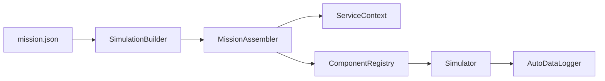
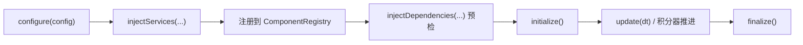

# 核心概念

框架的核心思想很简单：任务配置声明实体，实体装配组件和服务，仿真器按固定步长调度组件。

## 总览



`SimulationBuilder` 读配置并组织构建流程。`MissionAssembler` 根据 `entities[]` 安装服务、创建组件、注册接口。`Simulator` 只关心运行时调度。

## Component

组件是仿真里被调度的业务单元。所有组件都继承 `gnc::core::ComponentBase`，通常会实现一个或多个接口。

组件生命周期按这个顺序执行：



`configure()` 读取组件自己的 JSON 配置。`injectServices()` 读取服务。`injectDependencies()` 绑定其他组件。`update()` 执行离散更新；如果组件实现 `IContinuousSystem`，仿真器会先用积分器推进状态，再调用 `update()`。

## Plugin

插件是编译期模块，不是运行时动态库。插件通过 `Plugin::install()` 注册组件类型或服务安装器。

当前内置插件包括：

| 插件 | 层级 | 作用 |
| --- | --- | --- |
| `environment` | Subsystem | 地球、气动环境、重力模型 |
| `aero` | Subsystem | 气动模型 |
| `state_3dof` | Subsystem | 三自由度状态组件 |
| `soviet_coord` | System | 苏式坐标系服务 |

项目组件不需要写插件。它们放在 `user/<project>/components/`，用 `GNC_REGISTER_COMPONENT_TYPE` 注册。

## Entity

实体是 `mission.json` 里的顶层装配单元。当前支持两种角色：

| role | 中文含义 | 命名规则 |
| --- | --- | --- |
| `environment` | 环境实体 | 组件注册为 `env.<name>` |
| `vehicle` | 飞行器实体 | 组件注册为 `<entity_id>.<name>` |

环境实体会先装配，飞行器实体后装配。当前只支持一个环境实体。环境实体的 `id` 可以写成 `environment`，但组件前缀固定为 `env.`。

## Service

服务是非组件能力，存放在 `ServiceContext`。服务通常用于基础设施能力，比如坐标变换，而不是用于表达一个会被仿真器逐步调度的模型。

服务有三种作用域：

| 配置位置 | 可见范围 |
| --- | --- |
| `global_services` | 所有实体 |
| 环境实体的 `services` | 环境实体和所有飞行器实体 |
| 飞行器实体的 `services` | 当前飞行器实体 |

组件接收服务的顺序是 `global -> environment -> vehicle`。后一个作用域可以补充更局部的能力，但文档建议优先保持服务作用域清晰，不要把飞行器私有服务放进全局。

## Registry 和 ScopedRegistry

`ComponentRegistry` 保存所有组件实例，并记录每个组件实现了哪些接口。

`ScopedRegistry` 是带实体作用域的查找视图。组件在同一飞行器内查找依赖时，可以写局部名：

```cpp
registry.bindAll(gnc::core::bind(state_solver_, "dynamics"));
```

如果组件名包含点号，框架把它视为完整名，不再自动补前缀：

```cpp
registry.bindAll(gnc::core::bind(atmosphere_, "env.atmosphere"));
```

因此，同实体依赖适合写局部名，跨实体依赖应写完整名。

## Interface

接口表达能力，不表达所有权。组件依赖接口，而不是依赖具体组件类。

常见接口包括：

| 接口 | 作用 |
| --- | --- |
| `IContinuousSystem` | 暴露状态向量和导数函数，交给积分器推进 |
| `IObservable` | 暴露稳定字段，交给自动记录器写 CSV |
| `IStateSolver3DOF` | 提供三自由度状态查询 |
| `IFlightCommandProvider3DOF` | 提供三自由度飞行指令 |
| `IAeroModel` | 提供气动系数 |
| `IEarth`、`IAtmosphere`、`IGravity` | 提供环境能力 |

接口是插件之间的边界。低层插件不要包含高层插件的具体实现。

## Mission

`mission.json` 是任务装配说明，不是脚本。它声明仿真步长、输出、服务和实体图。框架按配置创建对象，后续运行由 `Simulator` 负责。

任务配置的详细写法见 [任务配置](03-mission-configuration.md)。

