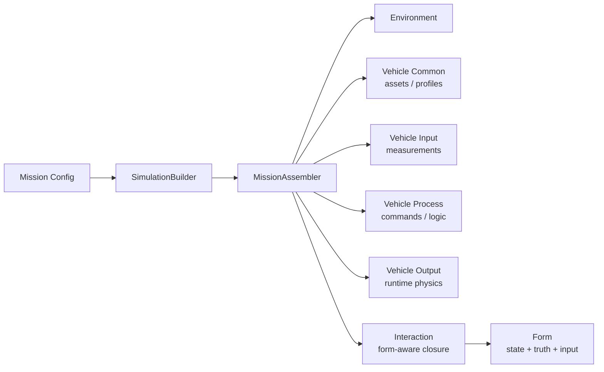

# Architecture

## System View



## Boundary Definitions

### Form

`Form` owns:

- state representation
- propagation equations
- typed truth surfaces
- typed input surfaces
- form-local math

### Environment

`Environment` owns world queries:

- Earth
- atmosphere
- gravity
- other world-side models

### Vehicle Common

`vehicle.common` is the static asset/profile layer.

It may describe:

- selected reference vehicle profile
- dataset paths
- parameter bundles
- passive initialization data

It does not own runtime physical behavior.

### Vehicle Input

`vehicle.input` is the measurement layer.

It is where sensor-side runtime packages belong.

### Vehicle Process

`vehicle.process` is the software and command-generation layer.

### Vehicle Output

`vehicle.output` is the runtime physical-effect layer.

It owns:

- aero models active at runtime
- mass models and mass evolution
- propulsion
- separation and configuration switching
- other effectors

### Interaction

`Interaction` closes:

- environment queries
- form truth
- process commands
- output-layer runtime capability

into form input.

## Scheduling

Per-step stage order is:

1. environment
2. vehicle.input
3. vehicle.process
4. vehicle.output
5. interaction
6. form

`vehicle.common` is intentionally outside this schedule.

## Assets and Reference Vehicles

Reference vehicle data should live as assets, for example:

```text
framework/data/vehicles/cavh/
```

Runtime components then load those assets through their own configuration.

That keeps:

- assets
- loaders
- runtime components

as three separate responsibilities.
