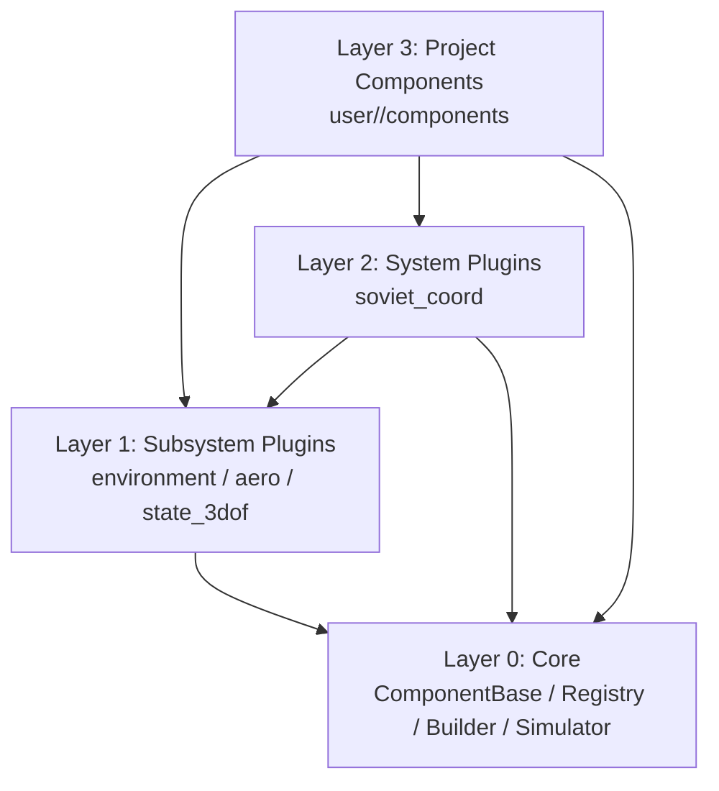
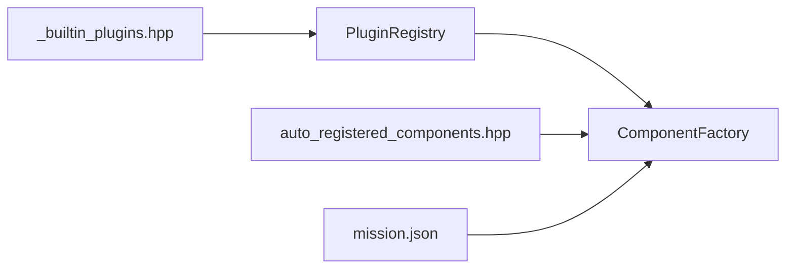
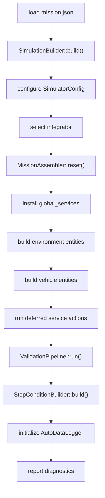
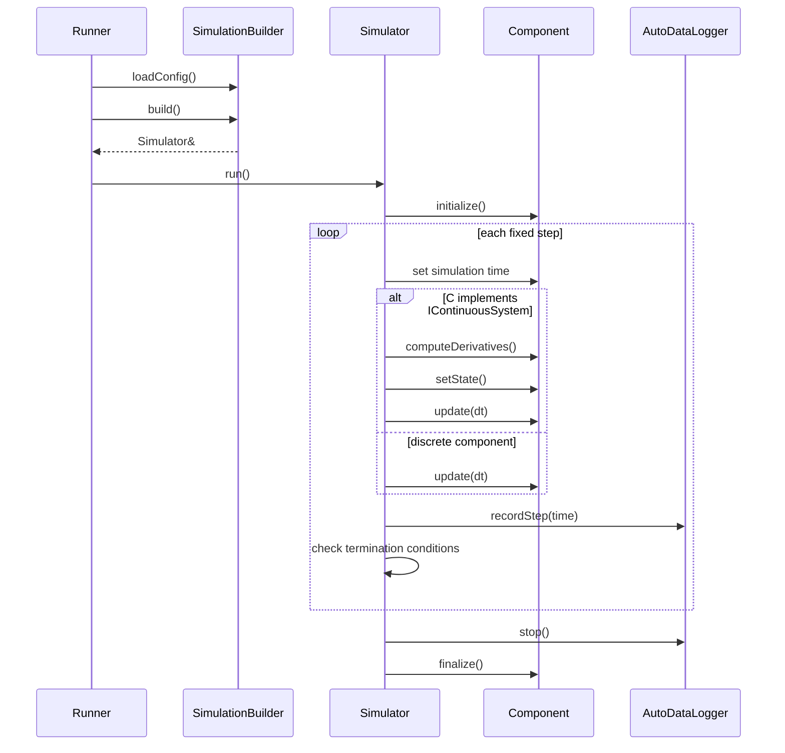

# 架构说明

框架的目标是把“仿真内核”“可复用模型”“系统级服务”和“项目算法”拆开。每层只暴露必要接口，任务配置负责把它们装配成一次仿真。

## 四层模型

边界要求：

- Core 不依赖具体插件
- 子系统插件提供物理模型和基础接口
- 系统插件组合低层接口形成更高层服务
- 项目组件编写任务算法和试验逻辑

## 注册模型

内置插件通过 `framework/include/gnc/plugins/_builtin_plugins.hpp` 被命令行入口包含。插件构造时注册到 `PluginRegistry`，并在 `Plugin::install()` 里注册组件类型或服务安装器。

项目组件通过 CMake 生成的 `auto_registered_components.hpp` 被包含。组件头文件里的 `GNC_REGISTER_COMPONENT_TYPE` 会把 type id 注册到 `ComponentFactory`。

运行时只根据 type id 创建已注册组件，不扫描动态库。

## 构建职责拆分

当前构建链路分成四块：

| 类型 | 职责 |
| --- | --- |
| `SimulationBuilder` | 高层编排。读取 mission、设置 `SimulatorConfig`、选择积分器、串联装配、验证、停机条件和 logger 初始化，并汇总最终诊断 |
| `MissionAssembler` | 根据 `entities[]` 安装服务、创建组件、注册接口、执行延迟服务动作 |
| `ValidationPipeline` | 先跑 `DependencyValidator`，再做 build 期 `injectDependencies` 预检，并收集验证错误和警告 |
| `StopConditionBuilder` | 解析 `simulation.stop_conditions`，查找组件字段并注册终止条件 |

这条边界的意义是：

- “如何把 `entities[]` 变成服务和组件” 放进 `MissionAssembler`
- “构建完成前还要做哪些预检和派生构建” 放进 `ValidationPipeline` 和 `StopConditionBuilder`
- `SimulationBuilder` 只负责把这些步骤按顺序串起来

## 装配流程

补充规则：

- 环境实体先构建，飞行器实体后构建
- 服务注入顺序是 `global -> environment -> vehicle`
- 延迟服务动作在所有组件注册之后执行
- 若 mission 仍使用旧式根级 `components` / `services` / `vehicles`，会在构建阶段直接失败

## 运行时循环

运行时有两个容易忽略的点：

- `update()` 顺序按 mission 里的 `components[]` 声明顺序执行
- 连续系统先由积分器推进状态，再调用组件自己的 `update(dt)`

## 失败诊断

构建期会集中报告错误和警告。常见来源包括：

- 未知组件 type id
- 未知服务名
- 重复组件完整名
- 组件配置里存在未读取字段
- 依赖绑定失败或接口不匹配
- 停机条件引用了不存在的组件或字段
- mission 仍使用已废弃的旧根级结构

这些问题应该在仿真正式运行前暴露，而不是留到运行时才排查。
