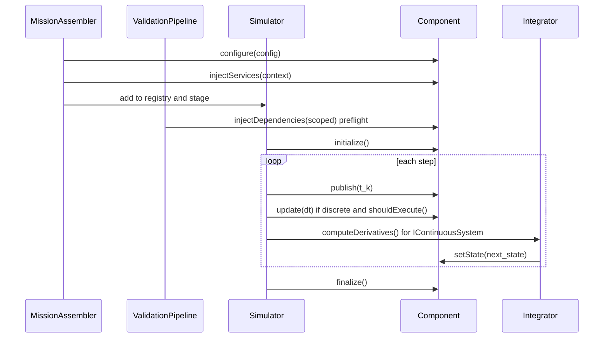

# 维护者架构说明

本文面向 framework 维护者，说明当前装配、调度、日志、停止条件、配置校验和源码阅读路径。先读 [00-current-architecture.md](00-current-architecture.md) 建立全貌，再用本文定位源码和修改点。

## 设计目标

GNCZMKN 的架构优先保证：

- mission 装配显式，组件 role/stage/form family 可验证。
- 固定步长时间语义可解释，CSV 行和发布态一一对应。
- 项目扩展可以落在 active project，不需要修改 framework。
- 物理参数失败早暴露，builtin 不静默吞掉关键配置错误。

当前明确不是全局联合 ODE 求解器，也不是通用服务容器。服务只承载稳定基础设施；任务流程、制导控制和物理闭合应留在组件和 interaction 中。

## 源码导览

| 你要理解什么 | 入口文件 |
| --- | --- |
| CLI、默认 mission、组件清单 | `src/runner.cpp` |
| builtin type id 注册 | `framework/include/gnc/bootstrap/register_builtin_packages.hpp` |
| builtin service 注册 | `framework/include/gnc/bootstrap/register_builtin_service_packages.hpp` |
| active project 自动注册链 | 根目录 `CMakeLists.txt` 生成的 `auto_registered_components.hpp` |
| type id 到 C++ 类的工厂 | `framework/include/gnc/core/component_factory.hpp` |
| mission parse 和 `$include` | `framework/include/gnc/core/config_manager.hpp` |
| required/optional 字段读取 | `framework/include/gnc/core/config_reader.hpp` |
| build 协调器 | `framework/include/gnc/core/simulation_builder.hpp` |
| environment/vehicle/component/service 装配 | `framework/include/gnc/core/mission_assembler.hpp` |
| scoped dependency lookup | `framework/include/gnc/core/scoped_registry.hpp` |
| role/stage/form-family/dependency 验证 | `framework/include/gnc/core/validation_pipeline.hpp` |
| 固定步长 runtime loop | `framework/include/gnc/core/simulator.hpp` |
| CSV、debug snapshot、summary | `framework/include/gnc/infrastructure/auto_data_logger.hpp` |

读源码时建议从 `runner.cpp -> SimulationBuilder::build() -> MissionAssembler::buildMission() -> Simulator::run()` 这一条主线开始，再回看各组件实现。

## 关键类职责

| 类 | 职责 | 不负责 |
| --- | --- | --- |
| `ComponentFactory` | 保存 type id、构造函数、接口、role、stage、form family、注册来源 | mission placement 决策 |
| `ConfigManager` | 解析配置文件、展开 `$include`、暴露 expanded root | 判断组件类型和依赖 |
| `SimulationBuilder` | 协调 config、integrator、assembler、validation、logger 初始化 | 组件内部物理逻辑 |
| `MissionAssembler` | 根据 mission 创建组件、命名、注入 service、加入 registry/stage | 每步调度执行 |
| `ScopedRegistry` | 将短名解析为当前 scope 内组件，并按接口取依赖 | 组件生命周期管理 |
| `ValidationPipeline` | 检查装配 descriptor、form family、dependency preflight | 修复错误配置 |
| `Simulator` | initialize、publish、stage update、record、termination、continuous integration | JSON parse 和 type 注册 |
| `AutoDataLogger` | 根据 `outputs` 发现 `IObservable` 字段并写 CSV/debug snapshot | 定义物理输出含义 |

## 构建流程

```text
runner.cpp
  -> registerBuiltinPackages(factory)
  -> registerAutoRegisteredProjectComponents(factory)
  -> resolve mission path
  -> SimulationBuilder::loadConfig()
  -> SimulationBuilder::build()
       -> parse simulation dt/duration/integrator
       -> MissionAssembler::installGlobalServices()
       -> MissionAssembler::buildMission()
       -> MissionAssembler::finalizeServices()
       -> ValidationPipeline::run()
       -> Simulator::initializeAutoDataLogger()
  -> Simulator::run()
```

`MissionAssembler` 的装配顺序是 environment、vehicles、termination、summary。每个组件被创建后会经历：

1. 从 `ComponentFactory` 按 `type` 创建对象。
2. 写入 type/category/origin 元数据。
3. 应用 `priority` 和 `rate_hz`。
4. 校验 role/stage/form family 和 required interface。
5. 调用 `configure(config, config_path)`。
6. 调用 `injectServices()` 注入 global/environment/vehicle service context。
7. 加入 `Simulator` 对应 stage bucket。
8. 注册到 `ComponentRegistry`，完整名如 `vehicle.dynamics`。

组件在 `ComponentFactory` 中带有 type id、category、role、stage、form family、interfaces 和注册来源。装配时 `MissionAssembler` 会产生 `AssemblyDescriptor`，供 `ValidationPipeline` 二次检查。

## 生命周期



生命周期方法的语义：

| 方法 | 调用时机 | 应该做什么 |
| --- | --- | --- |
| `configure()` | build 阶段，service injection 前 | 读取配置、校验 required 字段、加载资产 |
| `injectServices()` | build 阶段，组件进入 registry 前 | 从 `ServiceContext` 取 service 句柄 |
| `injectDependencies()` | validation preflight 或 initialize 阶段 | 从 `ScopedRegistry` 取其它组件接口 |
| `initialize()` | run 前一次 | 初始化缓存，必要时先 `publish(getSimTime())` |
| `publish(time)` | 每个周期开始 | 刷新 truth/view/observer 派生量，不积分 |
| `update(dt)` | 离散 stage 内 | 读取发布态，产生本周期离散输出 |
| `computeDerivatives()` | 连续积分阶段 | 根据传入 state 和发布态计算导数 |
| `setState()` | 所有 next state 计算完成后 | 提交连续状态 |
| `finalize()` | run 结束 | 释放资源或写最终统计 |

`ValidationPipeline` 的 dependency preflight 会调用一次 `injectDependencies()` 并标记组件已完成依赖注入；`Simulator::initialize()` 只对还没标记的组件补调用。实现 `injectDependencies()` 时应幂等，不应在里面推进状态。

## 调度模型

`Simulator` 使用固定步长和周期开始发布态：

```text
publish/refresh t_k
before_step(step, t_k, dt)
discrete update(t_k)
record t_k
termination check t_k
synchronized independent integration to t_{k+1}
after_step(step, t_{k+1}, dt)
```

离散 stage 顺序由 `Simulator::orderedStages()` 固定：

```text
environment -> vehicle_input -> vehicle_process -> vehicle_output
-> interaction -> form -> termination -> summary
```

`executeComponent()` 会跳过 `IContinuousSystem` 的 `update()`；连续系统只在 `integrateContinuousSystems()` 中由积分器调用 `computeDerivatives()`。低频组件通过 `rate_hz` 转换成整数 step interval；未执行的 step 继续暴露上一次输出。

publish 先使用 phase 顺序，再使用组件 priority：

```text
state owners（IContinuousSystem 或显式 StateOwner）
-> views / observers
-> ordinary components
```

在同一 execution stage 或 publish phase 内，较小的 `priority` 先执行；priority 相同则保持 mission/config 注册顺序。默认调度器不会让 priority 把 view 排到 state owner 前面。

## 连续系统

`IContinuousSystem` 不在 stage 中直接提交状态。每周期末先计算所有 next state，再统一 `setState()`：

- 导数读取的是 t_k 发布态。
- 提交发生在所有连续系统 next state 都算完之后。
- 这不是全局联合 ODE，也不表达连续强耦合。

如果未来需要联合积分，应新增明确的 state assembler 或 coupled group。

## 配置校验

`ConfigReader` 是 builtin 的轻量配置读取辅助。原则：

- 安全默认值可以保留，例如 `integrator = rk4`。
- 物理参数不静默默认，例如初始状态、质量、气动表、控制表。
- builtin unknown key 是 build error。
- 类型错误和 required 缺失是 build error。
- 错误消息应包含路径，例如 `vehicles[0].form.components[0].config.initial_state.altitude_m`。

`simulation.dt > 0`，`duration >= 0`，且 `duration / dt` 必须为整数步数。`priority` 必须是整数式 number；`rate_hz` 必须能整除仿真频率。

维护者添加 builtin 时，应同时更新：

- `register_builtin_packages.hpp` 或对应 service bootstrap。
- [06-reference.md](06-reference.md) 的 type id、placement、主要接口和配置字段。
- 至少一个成功装配测试和一个关键失败测试。
- 示例 mission 或文档片段，说明默认 lookup name 和输出字段。

## 配置解析边界

`ConfigManager` 只依赖 `IConfigParser` facade 和预处理层。当前内建 JSON 解析器是 `BuiltinJsonConfigParser`，后续替换为 nlohmann/json、yaml-cpp 或其它格式解析器时，不应影响 mission assembly 或 runtime component。

文件加载路径执行 parse -> `$include` preprocess -> expose expanded root。字符串加载路径不执行 filesystem include，出现 `$include` 会失败。

## 日志和停止条件

`AutoDataLogger` 记录 `IObservable` 字段。CSV 每行对应周期开始发布态 `t_k`；默认记录 `t0`。`record_initial_state=false` 可跳过 t0 数据行，但停止条件仍基于发布态。

CSV 行在 `update(t_k)` 之后写出：form/dynamics/truth view 字段是周期开始发布态 `x_k` 及其真实派生量；input/process/guidance/output 字段是 record 时刻各组件暴露的本周期离散输出。`t0` 行包含初始状态 `x_0` 和基于 `x_0` 计算出的第一周期导航/制导/输出。框架不保证所有 observable 在物理意义上无延迟；延迟语义由组件模型自身定义。

`termination` 是顶层组件，必须实现 `ITerminationEvaluator`。停止条件使用相同发布态，并在 record 之后检查，因此触发状态默认保留在 CSV 最后一行。`summary` 是顶层 observer 组件，必须实现 `ISummaryObserver`，其输出追加到 `summary.txt`。

## 多飞行器

当前多飞行器不是连续强耦合系统。文档规定跨 vehicle 读取应理解为读取发布态；world snapshot API 留到后续阶段实现。本阶段不禁止现有 direct lookup，避免把时间语义和跨 vehicle API 改造绑在同一风险面。

## 当前边界

- 多个 `IContinuousSystem` 是同步发布点下的独立积分，不是联合状态向量。
- `rate_hz` 是整数步间隔采样；低频组件在未执行 step 继续暴露上一次输出。
- `outputs` 更偏操作性配置：未知 key 是 warning，record 规则没有 builtin 组件配置那么严格。
- project component 的配置严格性由项目代码自己保证；framework 只对 builtin 强制 unknown-key error。
