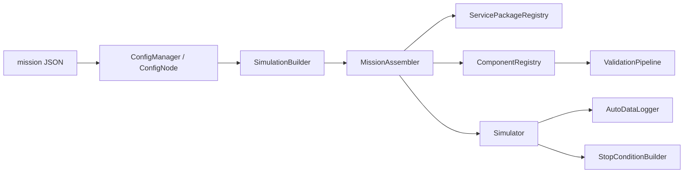

# 维护者架构说明

这篇文档面向维护 framework 的开发者，重点说明当前装配路径、服务边界、验证、日志和调度。用户侧概念请先读 [核心概念](02-core-concepts.md)。

## 系统视图

装配结果是一个 `Simulator`，其中包含 stage bucket、component registry、integrator、auto logger 和 stop conditions。

## 构建流程

高层流程：

1. `runner.cpp` 注册 builtin packages 和 active project components。
2. `SimulationBuilder` 加载 mission，解析 `simulation` 参数和 integrator。
3. `SimulationBuilder` 调用 `MissionAssembler` 装配服务和组件。
4. `MissionAssembler` 按 `environment -> vehicle prepare -> form -> vehicle groups -> interaction` 顺序注册组件。
5. service finalization task 在组件注册后执行。
6. `ValidationPipeline` 检查 assembly descriptor、role/stage/form-family 和依赖。
7. `StopConditionBuilder` 解析 `stop_conditions`。
8. `AutoDataLogger` 根据 `outputs` 初始化记录字段。

## 主要类型职责

| 类型 | 职责 |
| --- | --- |
| `SimulationBuilder` | 高层编排，加载配置、设置仿真参数、触发装配和验证、初始化停止条件和 logger |
| `MissionAssembler` | 按当前 mission schema 装配服务和组件，负责 placement 校验和 registry 命名 |
| `ComponentFactory` | 保存 type id 到 C++ 类型的创建器和注册元数据 |
| `ComponentRegistry` | 保存运行时组件实例和接口查询入口 |
| `ScopedRegistry` | 为组件依赖查询提供同作用域和跨作用域解析 |
| `ServicePackageRegistry` | 保存 service package，隔离服务创建和 finalization |
| `ValidationPipeline` | 汇总 build 期契约检查和依赖预检 |
| `AutoDataLogger` | 从 `IObservable` 组件收集 stable fields 并写 CSV |
| `StopConditionBuilder` | 解析 observable 字段并注册终止条件 |

## 命名和作用域

`MissionAssembler` 为不同 placement 添加前缀：

| Placement | 前缀 | 示例 |
| --- | --- | --- |
| `environment.components` | `env.` | `env.atmosphere` |
| `vehicles[].form.components` | `<id>.` | `cavh.dynamics` |
| `vehicles[].common/input/process/output` | `<id>.` | `cavh.guidance` |
| `vehicles[].interaction.components` | `<id>.` | `cavh.interaction` |

当前 runtime 以 `vehicles[]` 条目作为统一实体作用域。每个条目的 form、vehicle groups 和 interaction 共享 `<id>.` 作用域；单飞行器任务只是 `vehicles[]` 中只有一个条目。

## Placement 校验

组件注册元数据包括：

- `ComponentPackageRole`
- `ExecutionStage`
- `form_family`
- 暴露接口列表
- 注册来源

装配时会校验：

- 组件 role 与 mission placement 一致。
- 非调度块 `vehicle.common` 只能接受 `ExecutionStage::None`。
- 调度块如果声明了 stage，必须与 placement stage 一致。
- form-specific 组件的 form family 与 selected form family 一致。
- type id 未注册时给出可用 type 列表和最近匹配建议。

这些检查属于用户契约，不应为了旧示例恢复兼容分支。

## Service Package

服务通过 `ServicePackageRegistry` 装配，而不是散落在 `MissionAssembler` 中写特殊分支。

每个 service package 声明：

- service id
- 支持的 `ServiceScopeKind`
- service 创建逻辑
- 可选 finalization task

`MissionAssembler::buildServices()` 只做通用流程：查找 service package、校验作用域、创建服务、收集 finalization task。

当前 `coordinate_tree` 只支持 `vehicles[].services.coordinate_tree`。如果未来要支持 global 或 environment scope，应先定义跨 vehicle truth、frame 命名和生命周期，再扩展 service scope，而不是放宽现有校验。

## 调度模型

`Simulator` 使用固定 stage 顺序：

1. `Environment`
2. `VehicleInput`
3. `VehicleProcess`
4. `VehicleOutput`
5. `Interaction`
6. `Form`

`ExecutionStage::None` 不进入 stage bucket。当前循环以固定 `simulation.dt` 驱动 integrator、组件 update、logger 和 stop condition 检查。

引入可变步长不是只替换 integrator 接口。它会影响调度语义、日志采样、停止条件检查和 observable 时间点。

## 日志和停止条件

`AutoDataLogger` 只记录实现 `IObservable` 的组件。字段名由组件的 `getObservableFields()` 提供，输出配置可以选择：

- 所有 observable 组件。
- 某些组件的全部字段。
- 某些组件的字段列表。
- `exclude` 精确字段或后缀规则。
- 可选 `debug_snapshots`。

`StopConditionBuilder` 使用相同的 observable 字段体系。停止条件应引用完整组件名，例如 `cavh.dynamics`。

## 维护原则

- `SimulationBuilder` 保持高层编排，不积累具体服务、spec 或示例组件语义。
- 具体服务语义留在 service package 内。
- 示例组件和测试夹具不提升为 framework builtin API。
- 资产、loader 和 runtime component 分离。
- 文档、测试和错误信息应描述当前 schema，而不是旧兼容路径。
