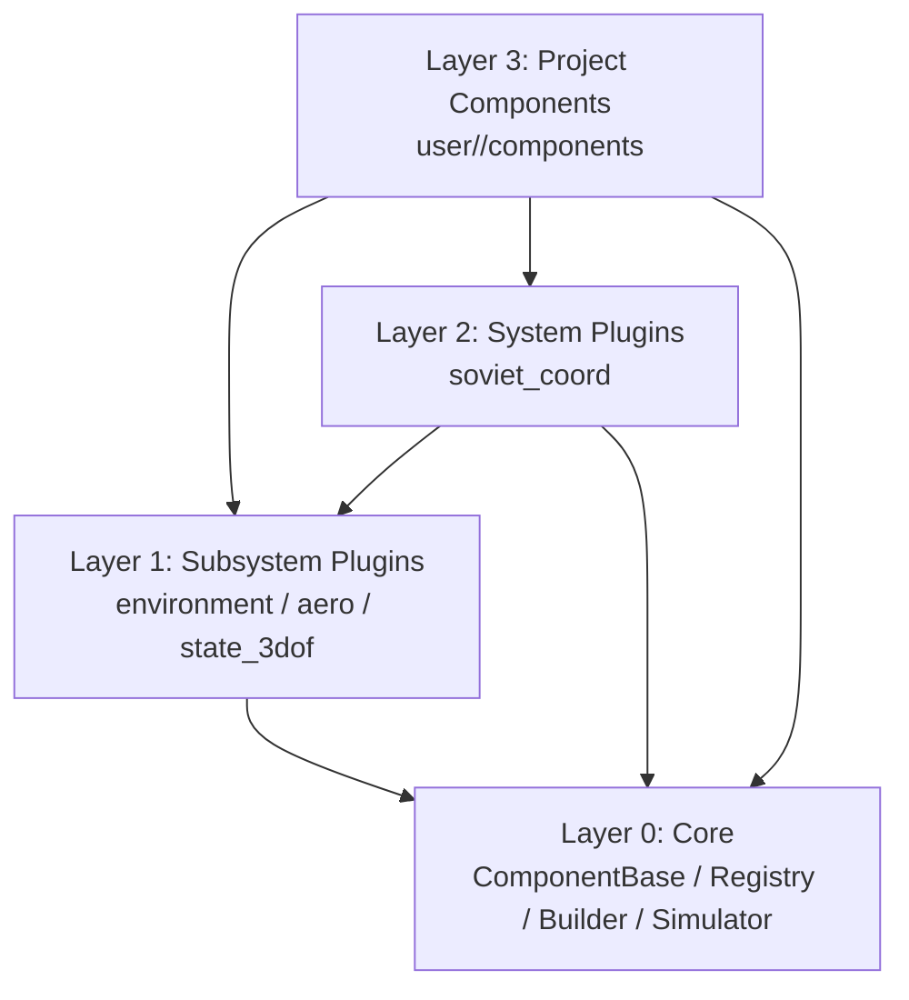
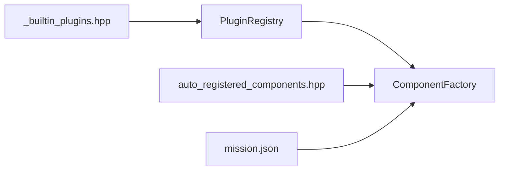
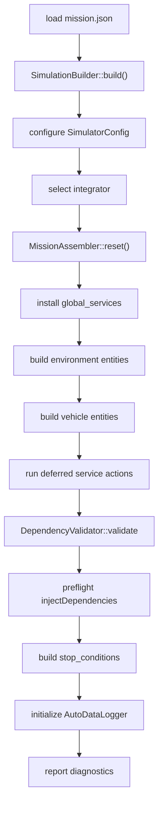
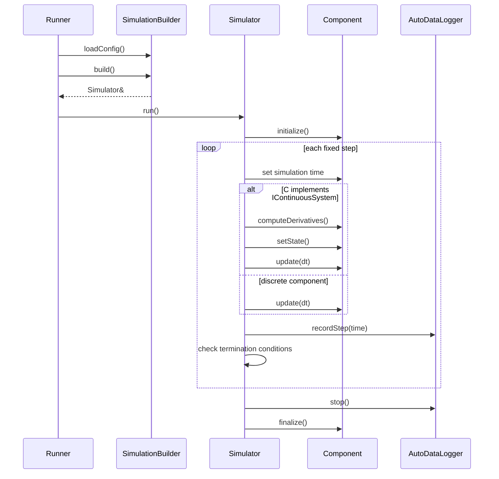

# 架构说明

框架的架构目标是把“仿真内核”、“可复用模型”、“系统级服务”和“项目算法”分开。每层只暴露必要接口，任务配置负责把它们装配成一次仿真。

## 四层模型

`Core` 不依赖任何具体插件。子系统插件提供物理模型和工程子系统。系统插件组合低层接口形成更高层服务。项目组件写任务算法和试验逻辑。

## 注册模型

内置插件通过 `framework/include/gnc/plugins/_builtin_plugins.hpp` 被命令行入口包含。插件构造时注册到 `PluginRegistry`，并在 `Plugin::install()` 中注册组件类型或服务安装器。

项目组件通过 CMake 生成的 `auto_registered_components.hpp` 被包含。组件头文件里的 `GNC_REGISTER_COMPONENT_TYPE` 会把 type id 注册到 `ComponentFactory`。

运行时只根据 type id 创建已注册组件，不扫描动态库。

## Builder 和 Assembler

`SimulationBuilder` 和 `MissionAssembler` 的职责必须分清：

| 类型 | 职责 |
| --- | --- |
| `SimulationBuilder` | 读取配置、设置仿真参数和积分器、调用装配器、做依赖验证、构建停止条件、初始化自动记录器、汇总构建诊断 |
| `MissionAssembler` | 重置装配状态、安装全局服务、按实体构建服务和组件、注册组件接口、执行延迟服务绑定 |

这条边界能防止 builder 继续膨胀。凡是“如何把 `entities[]` 变成服务和组件”的逻辑，应放在 `MissionAssembler`。凡是“构建完成后仿真器还需要什么”的逻辑，应留在 `SimulationBuilder`。

## 装配流程

环境实体先构建，飞行器实体后构建。服务注入顺序是 `global -> environment -> vehicle`。延迟服务动作在所有组件注册之后执行，用来处理服务到组件的绑定。

## 运行时循环

主循环使用固定步长。组件执行频率由 `ComponentBase::setExecutionFrequency()` 转换成步间隔。连续系统由积分器推进，离散组件只调用 `update(dt)`。

## 依赖方向

依赖方向应保持单向：

- Core 不包含具体插件。
- 子系统插件可以依赖 Core 和公共接口，不依赖项目组件。
- 系统插件可以依赖低层接口，不依赖项目组件。
- 项目组件可以依赖 Core、插件接口和必要的服务接口。
- 任务配置负责选择具体组件，不让组件自己创建其他组件。

如果某个功能被多个项目复用，先抽出接口，再考虑提升为内置插件。不要直接让项目组件反向污染底层插件。

## 失败诊断

构建期会集中报告错误和警告。常见诊断来自：

- 未知组件 type id。
- 未知服务名。
- 重复组件完整名。
- 组件配置里有未读取字段。
- 必需依赖找不到，或找到的组件没有实现目标接口。
- 停止条件引用了不存在的组件或字段。

这些诊断应该在仿真正式运行前暴露。运行时不应承担配置结构错误的主要排查成本。

