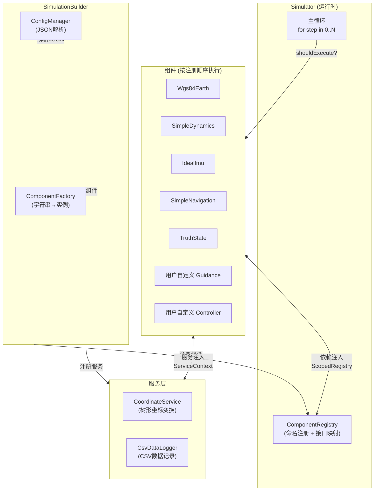
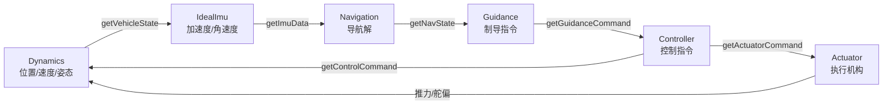
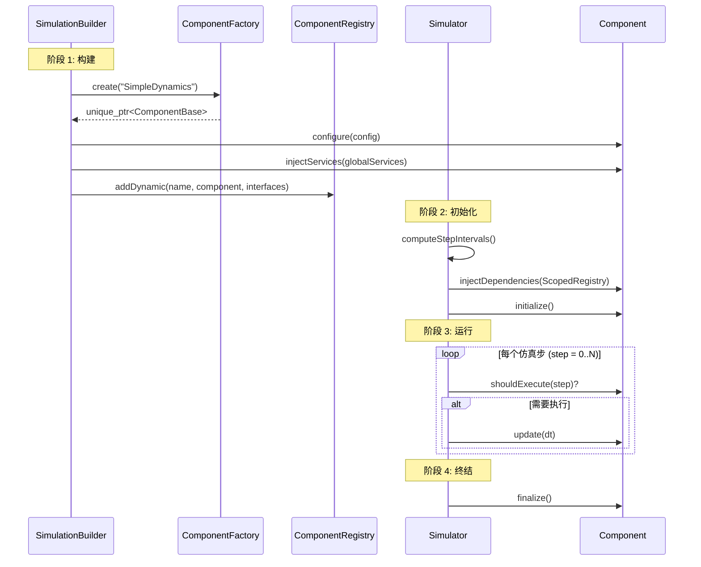

# GNC 仿真框架 -- 架构说明文档

> 版本: 1.0 &nbsp;|&nbsp; 最后更新: 2026-02-13

---

## 目录

1. [总体概览](#1-总体概览)
2. [五层架构](#2-五层架构)
3. [核心抽象层级图](#3-核心抽象层级图)
4. [数据总线机制](#4-数据总线机制)
5. [坐标系管理](#5-坐标系管理)
6. [组件生命周期](#6-组件生命周期)
7. [配置驱动](#7-配置驱动)
8. [扩展性说明](#8-扩展性说明)
9. [关键设计模式](#9-关键设计模式)

---

## 1. 总体概览

本框架是一个面向 **GNC（制导、导航与控制）** 仿真的 C++17 组件化框架。其设计目标是：

- **算法工程师只关心 GNC 策略本身**，无需操心坐标转换、积分器、日志、传感器仿真等基础设施。
- **三行代码** 即可启动一个完整仿真：

```cpp
SimulationBuilder builder;
builder.loadConfig("config/simulation.json");   // 1. 加载配置
auto& simulator = builder.build();               // 2. 构建仿真
simulator.run();                                 // 3. 运行仿真
```

框架支持**单飞行器**和**多飞行器**两种模式，通过 JSON 配置在两者之间无缝切换。

---

## 2. 五层架构

```
┌─────────────────────────────────────────────────────────────┐
│                     应用层 (Application)                     │
│  SimulationBuilder / Simulator / 具体组件实现                │
│  include/gnc/core/  +  include/gnc/components/              │
├─────────────────────────────────────────────────────────────┤
│                     服务层 (Service)                          │
│  CoordinateService / CsvDataLogger / ...                    │
│  include/gnc/services/  +  include/gnc/core/data_logger.hpp │
├─────────────────────────────────────────────────────────────┤
│                     接口层 (Interface)                        │
│  IDynamics / IGuidance / INavigation / IController / ...    │
│  include/gnc/interfaces/                                    │
├─────────────────────────────────────────────────────────────┤
│                     算法库 (Algorithm Library)                │
│  PID / StateSpace / Filters / CoordRotations                │
│  include/gnc/libraries/                                     │
├─────────────────────────────────────────────────────────────┤
│                     数学库 (Math Library)                     │
│  Eigen封装 / Quaternion / Rotation / Interp / Calculus / ...│
│  include/gnc/common/math/                                   │
└─────────────────────────────────────────────────────────────┘
```

### 2.1 数学库 (`include/gnc/common/math/`)

底层纯数学运算，基于 Eigen3。包含：

| 文件 | 功能 |
|------|------|
| `eigen_types.hpp` | Eigen 类型别名 (`Vector3`, `Matrix3`, `VectorX` 等) |
| `quaternion.hpp` | 四元数类 (w,x,y,z 存储，右乘法则) |
| `rotation.hpp` | 旋转算子 (支持欧拉角、轴-角、DCM、四元数相互转换) |
| `euler_sequences.hpp` | 12 种欧拉角序列 (ZYX, ZYZ, XYZ ...) |
| `calculus.hpp` | 数值积分 (RK4/RK45) 与 Jacobian 数值计算 |
| `interp.hpp` | 插值与拟合 (查表/样条/最小二乘) |
| `linalg.hpp` | 线性代数扩展 (SVD, 伪逆, Cholesky) |
| `special_functions.hpp` | 特殊函数 (Bessel, erf, sat, sign) |
| `statistics.hpp` | 概率统计 (高斯分布, 协方差) |
| `optimization.hpp` | 优化算法 (黄金分割, Nelder-Mead) |
| `nonlinear.hpp` | 非线性模型 (速率限制, 齿隙) |
| `roots.hpp` | 方程求根 (Newton, 多项式) |
| `transform.hpp` | 齐次变换矩阵 |

### 2.2 算法库 (`include/gnc/libraries/`)

面向 GNC 领域的可复用算法模块：

| 文件/目录 | 功能 |
|-----------|------|
| `pid_controller.hpp` | 增强型 PID (抗积分饱和 Clamp/BackCalc, 微分滤波, 前馈) + 增量式 PID |
| `control/state_space.hpp` | 状态空间模型 (连续/离散, SISO/MIMO, RK4积分) |
| `control/discretization.hpp` | 双线性变换 (Tustin 离散化) |
| `control/tf2ss.hpp` | 传递函数到状态空间的转换 |
| `filters/butterworth.hpp` | Butterworth 滤波器 |
| `filters/notch.hpp` | 陷波滤波器 |
| `filters/moving_average.hpp` | 滑动平均滤波器 |
| `coord/rotations.hpp` | 坐标旋转公式 (ECEF/NED/ENU/NSE/Launch/Body/Wind/Stability) |
| `state_machine.hpp` | 有限状态机 |

### 2.3 接口层 (`include/gnc/interfaces/`)

定义各模块之间的**契约**。所有具体实现必须满足这些接口。

```
interfaces/
├── data_types.hpp           # 标准数据包: ImuData, NavState, GuidanceCommand, ControlCommand, VehicleState...
├── coord/
│   └── frame_id.hpp         # 坐标系枚举: ECI, ECEF, NED, ENU, BODY, WIND, STABILITY, LAUNCH...
├── dynamics/
│   └── i_dynamics.hpp       # IDynamics: getVehicleState, setExternalForce/Torque, reset
├── environment/
│   ├── i_earth_model.hpp    # IEarthModel: getRadius, geodeticToEcef, ecefToGeodetic
│   ├── i_gravity_model.hpp  # IGravityModel: getGravity(position), getSeaLevelGravity
│   └── i_atmosphere_model.hpp # IAtmosphereModel: getDensity/Pressure/Temperature/SpeedOfSound
├── gnc/
│   ├── i_guidance.hpp       # IGuidance: getGuidanceCommand, setTarget, isActive
│   ├── i_navigation.hpp     # INavigation: getNavState, getTimestamp, isValid
│   └── i_controller.hpp     # IController: getControlCommand, getActuatorCommand, isActive
├── sensors/
│   ├── i_imu_sensor.hpp     # IImuSensor: getImuData, isHealthy
│   └── i_gps_sensor.hpp     # IGpsSensor: getGpsData, isHealthy
├── state/
│   └── i_vehicle_state.hpp  # IVehicleState: getPosition/Velocity/Attitude/LLA/Alpha/Beta/Mach...
├── vehicle/
│   ├── i_aerodynamics.hpp   # IAerodynamics: computeAeroForce/Moment, getReferenceArea
│   └── i_mass_property.hpp  # IMassProperty: getMass, getInertia
├── propulsion/
│   ├── i_engine.hpp         # IEngine: setThrottle, getThrust, getFuelConsumptionRate
│   └── i_actuator.hpp       # IActuator: setCommand, getDeflection
├── disturbance/
│   └── i_disturbance.hpp    # IDisturbance: getDisturbance, isEnabled
└── infrastructure/
    └── i_data_logger.hpp    # IDataLogger: beginSession, endSession, logStep
```

### 2.4 服务层 (`include/gnc/services/`)

跨组件的**领域基础设施服务**。组件通过 `ServiceContext` 按需获取。

| 服务 | 功能 |
|------|------|
| `CoordinateService` | 树形坐标系管理，LCA 算法路径查找，节点级缓存 |
| `CsvDataLogger` | CSV 数据记录，话题注册，类型安全采集 |

### 2.5 应用层 (`include/gnc/core/` + `include/gnc/components/`)

框架引擎和具体组件实现：

**核心引擎** (`core/`):

| 文件 | 功能 |
|------|------|
| `component_base.hpp` | 组件基类：生命周期 + 频率控制 + 依赖注入接口 |
| `component_factory.hpp` | 工厂模式：字符串 -> 组件实例 + 接口类型信息 |
| `component_registry.hpp` | 注册表：命名注册 + 接口查询 |
| `scoped_registry.hpp` | 作用域视图：飞行器级别的组件隔离 |
| `service_context.hpp` | 服务容器：类型索引的 DI 容器 |
| `config_manager.hpp` | JSON 解析 + 配置管理 (零外部依赖) |
| `simulation_builder.hpp` | 构建器：从配置文件一键构建仿真 |
| `simulator.hpp` | 仿真器：主循环 + 频率调度 + 生命周期管理 |
| `dependency_validator.hpp` | 依赖验证 + 执行阶段管理 |
| `data_logger.hpp` | CSV 数据记录器实现 |
| `data_formatters.hpp` | 数据格式化工具 |

**具体组件** (`components/`):

| 组件 | 继承关系 | 功能 |
|------|---------|------|
| `SimpleDynamics` | `ComponentBase` + `IDynamics` | 六自由度动力学 (欧拉积分, 含扰动叠加) |
| `Wgs84Earth` | `ComponentBase` + `IEarthModel` | WGS84 地球模型 (LLA/ECEF转换) |
| `IdealImu` | `ComponentBase` + `IImuSensor` | 理想 IMU (无噪声, 直接读取真值) |
| `SimpleNavigation` | `ComponentBase` + `INavigation` | 简单导航解算 (IMU 积分) |
| `TruthState` | `ComponentBase` + `IVehicleState` | 真值状态聚合 (计算 LLA, 攻角, 马赫数等) |

---

## 3. 核心抽象层级图

### 3.1 类继承关系

```mermaid
classDiagram
    class ComponentBase {
        <<abstract>>
        -name_ : string
        -freq_hz_ : double
        -step_interval_ : int
        +initialize() void
        +update(dt : double)* void
        +finalize() void
        +configure(config : ConfigNode) void
        +injectDependencies(registry : ScopedRegistry) void
        +injectServices(services : ServiceContext) void
        +shouldExecute(step : int) bool
    }

    class IDynamics {
        <<interface>>
        +getVehicleState() VehicleState
        +setExternalForce(force : Vector3d) void
        +setExternalTorque(torque : Vector3d) void
        +reset() void
    }

    class IGuidance {
        <<interface>>
        +getGuidanceCommand() GuidanceCommand
        +setTarget(target : Vector3d) void
        +isActive() bool
    }

    class INavigation {
        <<interface>>
        +getNavState() NavState
        +getTimestamp() double
        +isValid() bool
    }

    class IController {
        <<interface>>
        +getControlCommand() ControlCommand
        +getActuatorCommand() ActuatorCommand
        +isActive() bool
    }

    class IEarthModel {
        <<interface>>
        +getRadius() double
        +getRotationRate() double
        +geodeticToEcef(lat, lon, alt) Vector3d
        +ecefToGeodetic(ecef) void
    }

    class IImuSensor {
        <<interface>>
        +getImuData() ImuData
        +isHealthy() bool
    }

    class IVehicleState {
        <<interface>>
        +getPosition() Vector3
        +getVelocity() Vector3
        +getAttitude() Quaternion
        +getLLA() LLA
        +getAlpha() double
        +getMach() double
    }

    class SimpleDynamics {
        -state_ : VehicleState
        -external_force_ : Vector3d
        -disturbances_ : vector
    }

    class Wgs84Earth {
    }

    class IdealImu {
        -dynamics_ : IDynamics*
    }

    class SimpleNavigation {
        -imu_ : IImuSensor*
    }

    class TruthState {
        -dynamics_ : IDynamics*
    }

    ComponentBase <|-- SimpleDynamics
    IDynamics <|.. SimpleDynamics

    ComponentBase <|-- Wgs84Earth
    IEarthModel <|.. Wgs84Earth

    ComponentBase <|-- IdealImu
    IImuSensor <|.. IdealImu

    ComponentBase <|-- SimpleNavigation
    INavigation <|.. SimpleNavigation

    ComponentBase <|-- TruthState
    IVehicleState <|.. TruthState
```



### 3.2 框架运行时架构



### 3.3 数据流路径



---

## 4. 数据总线机制

### 4.1 核心机制：接口 + 注册表 + 拉取模型

本框架**没有**使用消息总线 (Message Bus) 或发布-订阅 (Pub/Sub)。取而代之的是 **接口查询 + 主动拉取** 模式：

```
┌────────────┐   injectDependencies()    ┌──────────────────┐
│  组件 A     │ ◄────────────────────────  │  ScopedRegistry  │
│  (Navigation) │    getByName<IImuSensor>  │  (作用域视图)     │
│             │      ("imu")              │                  │
│  imu_ = ...  │                           │                  │
└──────┬───────┘                           └────────┬─────────┘
       │                                            │
       │  update(dt) 时：                            │  底层查找：
       │  imu_->getImuData()                        │  "chaser.imu"
       ▼                                            ▼
┌────────────┐                             ┌──────────────────┐
│  组件 B     │                             │ ComponentRegistry│
│  (IdealImu)  │                             │ (全局注册表)      │
└────────────┘                             └──────────────────┘
```

### 4.2 三种数据流转方式

#### 方式一：组件间接口查询（主路径）

```cpp
// SimpleNavigation::injectDependencies 中
void injectDependencies(ScopedRegistry& registry) override {
    imu_ = registry.getByName<IImuSensor>("imu");
    // ScopedRegistry 自动添加 "chaser." 前缀 -> 查找 "chaser.imu"
}

// SimpleNavigation::update 中
void update(double dt) override {
    const auto& data = imu_->getImuData();   // 主动拉取，无拷贝开销
    nav_state_.velocity += data.acceleration * dt;
}
```

#### 方式二：外力/力矩设置（推送模式）

```cpp
// Controller 计算完控制指令后
dynamics_->setExternalForce(control_force);    // 推送到动力学
dynamics_->setExternalTorque(control_torque);
```

#### 方式三：服务查询

```cpp
// 组件获取坐标变换服务
void injectServices(ServiceContext& services) override {
    coord_service_ = services.get<CoordinateService>();
}

// 使用坐标变换
Matrix3 R = coord_service_->getRotation(FrameId::BODY, FrameId::ECEF, time);
```

### 4.3 数据包定义 (`interfaces/data_types.hpp`)

各模块间传递的标准化数据结构：

| 数据包 | 字段 | 用途 |
|-------|------|------|
| `ImuData` | acceleration, angular_velocity, timestamp | IMU 量测 |
| `GpsData` | position, velocity, timestamp, valid | GPS 量测 |
| `NavState` | position, velocity, attitude, angular_velocity | 导航解 |
| `GuidanceCommand` | acceleration_cmd, attitude_cmd | 制导指令 |
| `ControlCommand` | torque_cmd, force_cmd | 控制指令 |
| `ActuatorCommand` | commands (vector) | 执行器指令 |
| `VehicleState` | position, velocity, attitude, angular_velocity | 动力学输出 |
| `DisturbanceData` | force, torque | 扰动力/力矩 |

### 4.4 多飞行器隔离

多飞行器场景下，`ScopedRegistry` 提供命名空间隔离：

```
全局 ComponentRegistry:
  ├── env.earth          (环境组件, 所有飞行器共享)
  ├── chaser.dynamics    (追踪器的动力学)
  ├── chaser.imu         (追踪器的 IMU)
  ├── chaser.nav         (追踪器的导航)
  ├── target.dynamics    (目标的动力学)
  ├── target.imu         (目标的 IMU)
  └── target.nav         (目标的导航)

ScopedRegistry("chaser."):
  getByName<IDynamics>("dynamics")  →  查找 "chaser.dynamics"  ✓
  getByName<IEarthModel>("env.earth")  →  查找 "env.earth" (全名访问)  ✓
```

---

## 5. 坐标系管理

### 5.1 支持的坐标系 (`FrameId` 枚举)

| 枚举值 | 名称 | 说明 |
|--------|------|------|
| `ECI` | 地心惯性系 | Earth-Centered Inertial |
| `ECEF` | 地心地固系 | Earth-Centered Earth-Fixed |
| `NED` | 北东地系 | North-East-Down |
| `ENU` | 东北天系 | East-North-Up |
| `NSE` | 北天东系 | North-Sky-East (自定义) |
| `BODY` | 载体系 | 固连飞行器 |
| `WIND` | 风轴系 | 相对风方向 |
| `STABILITY` | 稳定轴系 | 气动分析用 |
| `LAUNCH` | 发射系 | 发射台参考 |
| `SENSOR` | 传感器系 | 传感器安装 |
| `CAMERA` | 相机系 | 相机安装 |

### 5.2 两套坐标转换机制

#### 机制一：旋转公式库 (静态公式)

位于 `libraries/coord/rotations.hpp`，提供**纯数学公式**：

```cpp
// ECEF → NED 旋转矩阵 (需提供经纬度参数)
Matrix3 R = ecef_to_ned_rotation(lat, lon);

// ECI → ECEF (需提供格林尼治恒星时)
Matrix3 R = eci_to_ecef_rotation(gast);

// Body → Wind (需提供攻角/侧滑角)
Matrix3 R = body_to_wind_rotation(alpha, beta);
```

涵盖的变换链：

```
ECI ←→ ECEF ←→ NED/ENU/NSE ←→ BODY ←→ WIND/STABILITY
                      ↓
                   LAUNCH
```

**数学约定**：
- 被动（坐标）变换: `v_new = M_{old→new} * v_old`
- 左乘法则: `M_total = M_last * ... * M_first`

#### 机制二：CoordinateService (动态树形管理)

位于 `services/coordinate/coordinate_service.hpp`，提供**运行时坐标系树管理**：

```
ECI (根)
├── ECEF  (由时间决定的旋转)
│   ├── NED  (由经纬度决定)
│   │   ├── BODY  (由姿态四元数决定)
│   │   │   ├── WIND  (由攻角/侧滑角决定)
│   │   │   ├── STABILITY  (由攻角决定)
│   │   │   └── SENSOR
│   │   └── CAMERA
│   ├── ENU
│   ├── NSE
│   └── LAUNCH
```

**核心特性**：
- **树形强约束**: 每个坐标系只能有一个父系
- **LCA 路径查找**: 自动找到两个坐标系的最近公共祖先 (Lowest Common Ancestor)，组合变换链
- **节点级缓存**: 每个节点缓存旋转矩阵 + 时间戳，避免重复计算
- **Lambda 驱动**: 变换由 `RotationProvider` (Lambda) 提供，支持时变旋转

```cpp
// 设置根节点
coord_service.setRoot(FrameId::ECI);

// 注册变换关系
coord_service.registerTransform(FrameId::ECEF, FrameId::ECI,
    [&]() { return eci_to_ecef_rotation(current_gast); });

coord_service.registerTransform(FrameId::NED, FrameId::ECEF,
    [&]() { return ecef_to_ned_rotation(lat, lon); });

// 自动路径查找 + 组合变换
Matrix3 R = coord_service.getRotation(FrameId::BODY, FrameId::ECI, sim_time);
Vector3 v_eci = coord_service.transform(v_body, FrameId::BODY, FrameId::ECI, sim_time);
```

### 5.3 TruthState 中的坐标系使用

`TruthState` 组件展示了实际的坐标系使用方式：

```cpp
void computeAeroParams() {
    // ECEF → NED 旋转
    Matrix3 R_ecef_ned = ecef_to_ned_rotation(lla_.lat, lla_.lon);
    // NED → Body 旋转 (来自姿态四元数)
    Matrix3 R_ned_body = attitude_.toRotationMatrix();
    // 将 ECEF 速度转到 Body 系
    Vector3 v_body = R_ned_body * R_ecef_ned * velocity_;
    // 从 Body 系速度计算攻角/侧滑角
    alpha_ = std::atan2(v_body.z(), v_body.x());
    beta_ = std::asin(v_body.y() / airspeed_);
}
```

---

## 6. 组件生命周期

### 6.1 完整生命周期



### 6.2 频率调度

每个组件可以设置独立的执行频率：

```cpp
class IdealImu : public ComponentBase, public IImuSensor {
    IdealImu() : ComponentBase("IdealImu") {
        setExecutionFrequency(100.0);  // 100 Hz
    }
};
```

Simulator 根据仿真步长自动计算执行间隔：

```
仿真频率 = 1/dt = 100 Hz (dt=0.01s)

组件频率  →  步长间隔  →  执行步数
100 Hz    →  interval=1  →  每步执行 (0,1,2,3,4,...)
 50 Hz    →  interval=2  →  隔步执行 (0,2,4,6,...)
 10 Hz    →  interval=10 →  每10步执行 (0,10,20,...)
  0 Hz    →  interval=1  →  每步执行 (特殊值：0=每步)
```

### 6.3 执行顺序

组件按**注册顺序**执行。JSON 配置中组件的声明顺序决定了执行顺序。
典型的正确顺序：

```
1. Environment (earth)       ← 先更新环境
2. Dynamics                  ← 积分运动方程
3. TruthState                ← 计算派生量
4. Sensors (IMU, GPS)        ← 采样传感器
5. Navigation                ← 导航滤波
6. Guidance                  ← 制导计算
7. Controller                ← 控制计算
```

---

## 7. 配置驱动

### 7.1 单飞行器配置

```json
{
    "simulation": {
        "dt": 0.01,
        "duration": 10.0
    },
    "components": [
        {
            "type": "Wgs84Earth",
            "name": "earth",
            "config": {}
        },
        {
            "type": "SimpleDynamics",
            "name": "dynamics",
            "config": {
                "initial_position": [0, 0, 100]
            }
        },
        {
            "type": "IdealImu",
            "name": "imu",
            "config": {
                "frequency_hz": 100
            }
        },
        {
            "type": "SimpleNavigation",
            "name": "navigation",
            "config": {}
        }
    ]
}
```

### 7.2 多飞行器配置

```json
{
    "simulation": {
        "dt": 0.01,
        "duration": 30.0
    },
    "environment": {
        "components": [
            { "type": "Wgs84Earth", "name": "earth", "config": {} }
        ]
    },
    "vehicles": [
        {
            "id": "chaser",
            "services": {
                "coordinate": { "enabled": true }
            },
            "components": [
                { "type": "SimpleDynamics", "name": "dynamics", "config": {} },
                { "type": "IdealImu", "name": "imu", "config": {} },
                { "type": "SimpleNavigation", "name": "nav", "config": {} }
            ]
        },
        {
            "id": "target",
            "components": [
                { "type": "SimpleDynamics", "name": "dynamics", "config": {} }
            ]
        }
    ]
}
```

### 7.3 ConfigNode API

框架内置了零依赖的 JSON 解析器。`ConfigNode` 提供：

```cpp
config["key"]              // 对象访问
config[0]                  // 数组访问
config.asDouble(default)   // 获取数值
config.asString(default)   // 获取字符串
config.asBool(default)     // 获取布尔值
config.asInt(default)      // 获取整数
config.has("key")          // 检查键是否存在
config.size()              // 数组/对象大小
config.isNull()            // 是否为空
```

---

## 8. 扩展性说明

### 8.1 添加新的制导算法 (如比例导引法)

**继承**: `ComponentBase` + `IGuidance`

```cpp
// my_guidance.hpp
#include "gnc/core/component_base.hpp"
#include "gnc/core/component_factory.hpp"
#include "gnc/core/scoped_registry.hpp"
#include "gnc/interfaces/gnc/i_guidance.hpp"
#include "gnc/interfaces/gnc/i_navigation.hpp"

class ProNavGuidance : public gnc::core::ComponentBase,
                       public gnc::interfaces::IGuidance {
public:
    ProNavGuidance() : ComponentBase("ProNavGuidance") {
        setExecutionFrequency(50.0);
    }

    // 依赖注入
    void injectDependencies(gnc::core::ScopedRegistry& reg) override {
        nav_ = reg.getByName<gnc::interfaces::INavigation>("nav");
    }

    // 配置
    void configure(const gnc::core::ConfigNode& cfg) override {
        N_ = cfg["navigation_gain"].asDouble(3.0);
    }

    // 制导更新
    void update(double dt) override {
        if (!nav_ || !nav_->isValid()) return;
        const auto& state = nav_->getNavState();
        // ... 比例导引计算 ...
        cmd_.acceleration_cmd = /* 计算结果 */;
        cmd_.timestamp = state.timestamp;
    }

    const gnc::interfaces::GuidanceCommand& getGuidanceCommand() const override { return cmd_; }
    void setTarget(const Vector3d& t) override { target_ = t; }
    bool isActive() const override { return true; }

private:
    gnc::interfaces::INavigation* nav_ = nullptr;
    gnc::interfaces::GuidanceCommand cmd_;
    Vector3d target_;
    double N_ = 3.0;
};

// 注册到工厂 (放在头文件末尾)
GNC_REGISTER_COMPONENT(ProNavGuidance, gnc::interfaces::IGuidance)
```

**JSON 配置中使用**:

```json
{
    "type": "ProNavGuidance",
    "name": "guidance",
    "config": { "navigation_gain": 4.0 }
}
```

### 8.2 添加新的气动数据表

**继承**: `ComponentBase` + `IAerodynamics`

```cpp
class TabulatedAero : public gnc::core::ComponentBase,
                      public gnc::interfaces::IAerodynamics {
public:
    TabulatedAero() : ComponentBase("TabulatedAero") {}

    void configure(const gnc::core::ConfigNode& cfg) override {
        // 从配置加载数据表文件路径
        // 使用 gnc::math::LookupTable1D 进行插值
    }

    Vector3d computeAeroForce(double alpha, double beta,
                               double mach, double q) const override {
        double Cd = cd_table_.interpolate(mach, alpha);
        double Cl = cl_table_.interpolate(mach, alpha);
        double ref_area = getReferenceArea();
        // 构造体轴系气动力
        return Vector3d{-Cd * q * ref_area, 0, -Cl * q * ref_area};
    }

    Vector3d computeAeroMoment(double alpha, double beta,
                                double mach, double q) const override {
        // 类似插值计算
    }

    double getReferenceArea() const override { return ref_area_; }
    double getReferenceLength() const override { return ref_length_; }

    void update(double dt) override { /* 气动数据表通常不需要更新 */ }

private:
    gnc::math::LookupTable1D cd_table_, cl_table_;
    double ref_area_ = 1.0;
    double ref_length_ = 1.0;
};

GNC_REGISTER_COMPONENT(TabulatedAero, gnc::interfaces::IAerodynamics)
```

### 8.3 添加新的环境模型 (如大气模型)

**继承**: `ComponentBase` + `IAtmosphereModel`

```cpp
class StandardAtmosphere : public gnc::core::ComponentBase,
                            public gnc::interfaces::IAtmosphereModel {
public:
    StandardAtmosphere() : ComponentBase("StandardAtmosphere") {}

    double getDensity(double alt) const override {
        // 国际标准大气模型公式
    }
    double getPressure(double alt) const override { /* ... */ }
    double getTemperature(double alt) const override { /* ... */ }
    double getSpeedOfSound(double alt) const override { /* ... */ }

    void update(double dt) override { /* 静态模型不需要更新 */ }
};

GNC_REGISTER_COMPONENT(StandardAtmosphere, gnc::interfaces::IAtmosphereModel)
```

### 8.4 扩展步骤总结

| 步骤 | 操作 |
|------|------|
| 1 | 确定需要实现的接口 (在 `interfaces/` 中查找) |
| 2 | 创建新类，继承 `ComponentBase` + 目标接口 |
| 3 | 实现 `update(dt)` (核心算法) |
| 4 | 按需实现 `configure()` (读取配置)、`injectDependencies()` (获取其他组件)、`injectServices()` (获取服务) |
| 5 | 在文件末尾使用 `GNC_REGISTER_COMPONENT(ClassName, InterfaceType)` 自动注册 |
| 6 | 在 JSON 配置的 `components` 数组中添加新组件 |
| 7 | 在 `main.cpp` 中 `#include` 组件头文件 (触发自动注册) |

**无需修改框架的任何文件。**

---

## 9. 关键设计模式

| 设计模式 | 用途 | 位置 |
|---------|------|------|
| **工厂模式** (Factory) | 字符串到组件实例的映射，支持配置驱动创建 | `component_factory.hpp` |
| **注册表模式** (Registry) | 命名管理 + 接口查询，解耦组件间依赖 | `component_registry.hpp` |
| **依赖注入** (DI) | 组件通过 `injectDependencies` 获取依赖，而非自行创建 | `component_base.hpp` |
| **服务定位器** (Service Locator) | 按类型索引的服务容器，"按需付费" | `service_context.hpp` |
| **构建器模式** (Builder) | 从配置一键构建完整仿真 | `simulation_builder.hpp` |
| **作用域隔离** (Scoped View) | 多飞行器命名空间隔离 | `scoped_registry.hpp` |
| **模板方法** (Template Method) | `ComponentBase` 定义生命周期框架，子类实现具体逻辑 | `component_base.hpp` |
| **观察者模式** (Observer, 变体) | 数据话题注册 + 采集 | `data_logger.hpp` |
| **LCA 树形路径查找** | 自动组合坐标系变换链 | `coordinate_service.hpp` |
