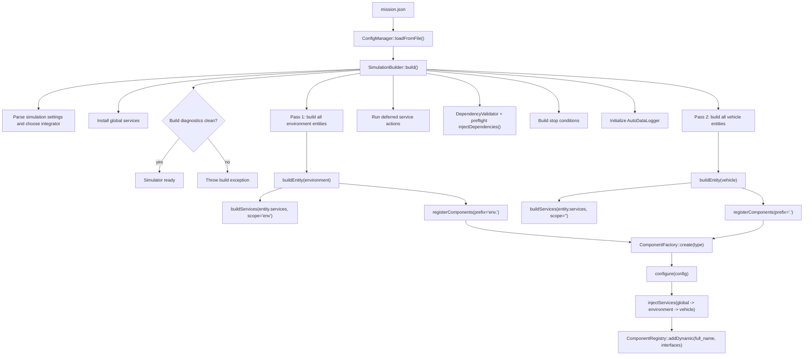
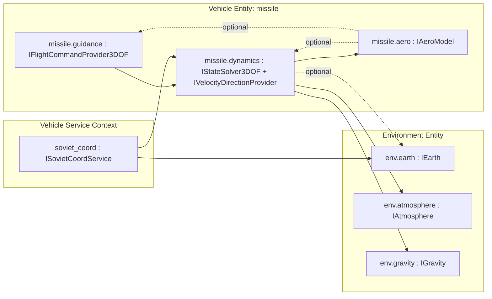

# Component Assembly

This page shows the build-time assembly path for the current entity-first
mission model.

## Build Flow

## Runtime Dependency Shape

## Notes

- Environment entities are always assembled before vehicle entities, regardless
  of `entities[]` declaration order.
- Cross-entity component dependencies use explicit scoped names such as
  `env.atmosphere`.
- Same-entity dependencies may use local names such as `guidance`; they resolve
  through the requester's entity scope.
- Stop conditions, output recording rules, and service bindings should use full
  scoped names such as `vehicle.dynamics` or `missile.dynamics`.
- Component registration order inside one entity becomes runtime execution
  order inside `Simulator::step()`.
- `injectDependencies()` is not executed during `buildEntity()`. The builder
  first registers the whole mission graph, then validates and preflights
  bindings after deferred service actions complete.
