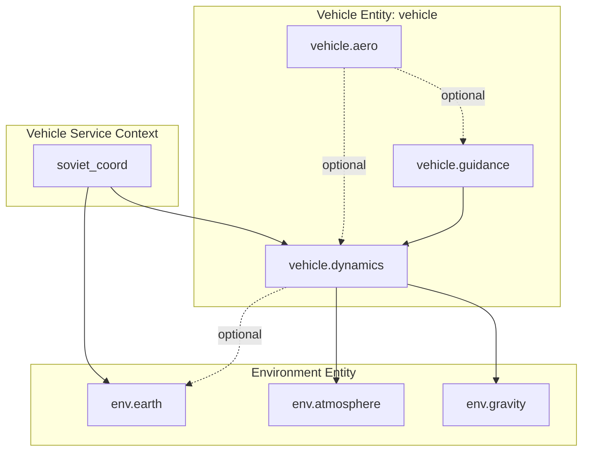
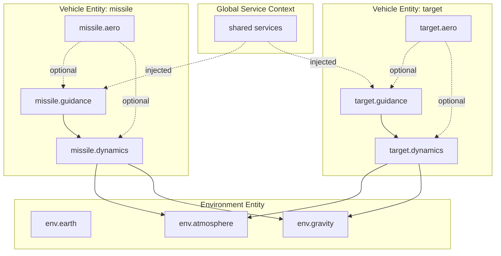

# Mission Topologies

This page gives concrete topology examples for the two mission shapes discussed
most often in design reviews:

- single-vehicle missions,
- multi-vehicle missions.

For Chinese discussions, these correspond to:

- `single-vehicle` = `单飞行器`,
- `multi-vehicle` = `多飞行器`.

## Single-Vehicle Mission

The smallest entity-first mission usually contains:

- one environment entity,
- one vehicle entity,
- optional vehicle-local services such as `soviet_coord`.



Minimal JSON shape:

```json
{
  "global_services": {},
  "entities": [
    {
      "id": "vehicle",
      "role": "vehicle",
      "services": {
        "soviet_coord": {
          "bindings": {
            "earth": { "name": "env.earth" },
            "velocity_direction": { "name": "vehicle.dynamics" }
          }
        }
      },
      "components": [
        { "type": "example.guidance", "name": "guidance", "config": {} },
        { "type": "aero.simple_polynomial", "name": "aero", "config": {} },
        { "type": "state_3dof.point_mass_spherical", "name": "dynamics", "config": {} }
      ]
    },
    {
      "id": "environment",
      "role": "environment",
      "components": [
        { "type": "environment.wgs84_earth", "name": "earth", "config": {} },
        { "type": "environment.standard_atmosphere", "name": "atmosphere", "config": {} },
        { "type": "environment.spherical_gravity", "name": "gravity", "config": {} }
      ]
    }
  ]
}
```

Key points:

- even in a single-vehicle mission, component names stay prefixed as
  `vehicle.*`,
- cross-entity dependencies are explicit,
- stop conditions and logging rules should reference the full names such as
  `vehicle.dynamics`.

## Multi-Vehicle Mission

A multi-vehicle mission extends the same model rather than switching to a
different assembly path.



Typical JSON shape:

```json
{
  "global_services": {
    "shared_service": {}
  },
  "entities": [
    {
      "id": "missile",
      "role": "vehicle",
      "components": [
        { "type": "example.guidance", "name": "guidance", "config": {} },
        { "type": "aero.simple_polynomial", "name": "aero", "config": {} },
        { "type": "state_3dof.point_mass_spherical", "name": "dynamics", "config": {} }
      ]
    },
    {
      "id": "target",
      "role": "vehicle",
      "components": [
        { "type": "example.guidance", "name": "guidance", "config": {} },
        { "type": "aero.simple_polynomial", "name": "aero", "config": {} },
        { "type": "state_3dof.point_mass_spherical", "name": "dynamics", "config": {} }
      ]
    },
    {
      "id": "environment",
      "role": "environment",
      "components": [
        { "type": "environment.wgs84_earth", "name": "earth", "config": {} },
        { "type": "environment.standard_atmosphere", "name": "atmosphere", "config": {} },
        { "type": "environment.spherical_gravity", "name": "gravity", "config": {} }
      ]
    }
  ]
}
```

Key points:

- every vehicle keeps its own local namespace,
- same-role components may reuse the same local names because the prefixes keep
  them distinct,
- the builder still assembles environment first, then all vehicles,
- global services are shared, while vehicle services stay vehicle-local unless
  deliberately moved to `global_services`.

## Naming Guidance

- Use `vehicle.*` only for an actual single-vehicle mission.
- Use semantic ids such as `missile`, `target`, `interceptor`, or `decoy` for
  multi-vehicle missions.
- Keep logging, stop conditions, and service bindings aligned with the full
  scoped component names.
