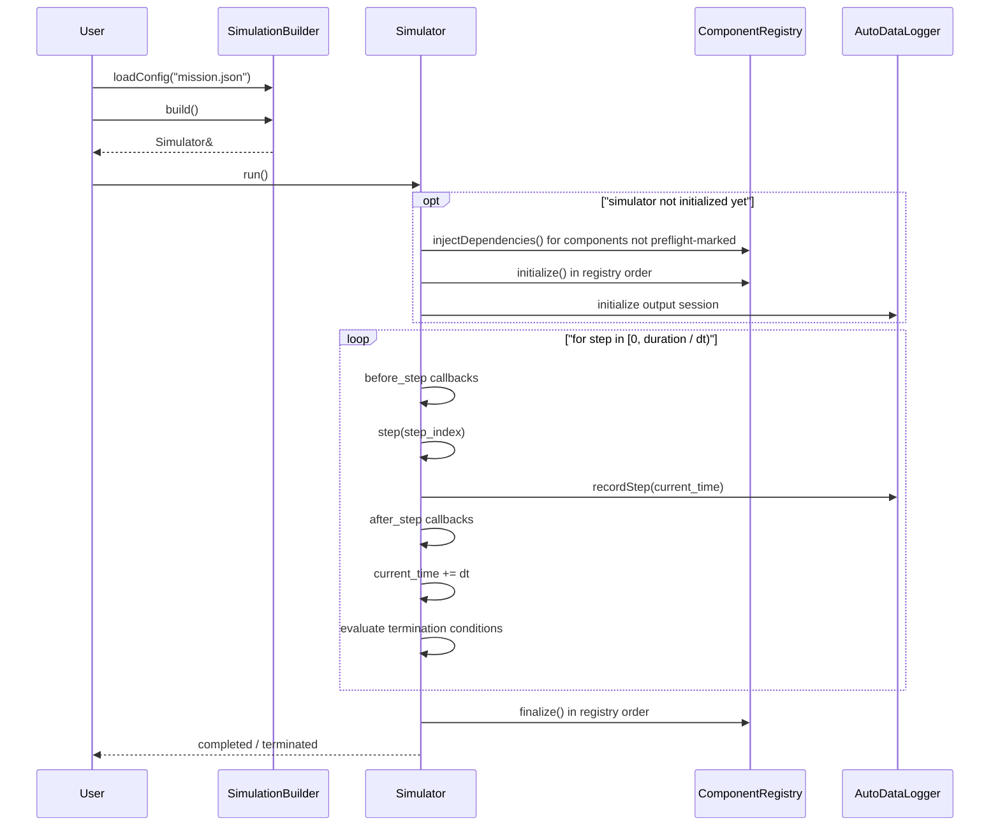
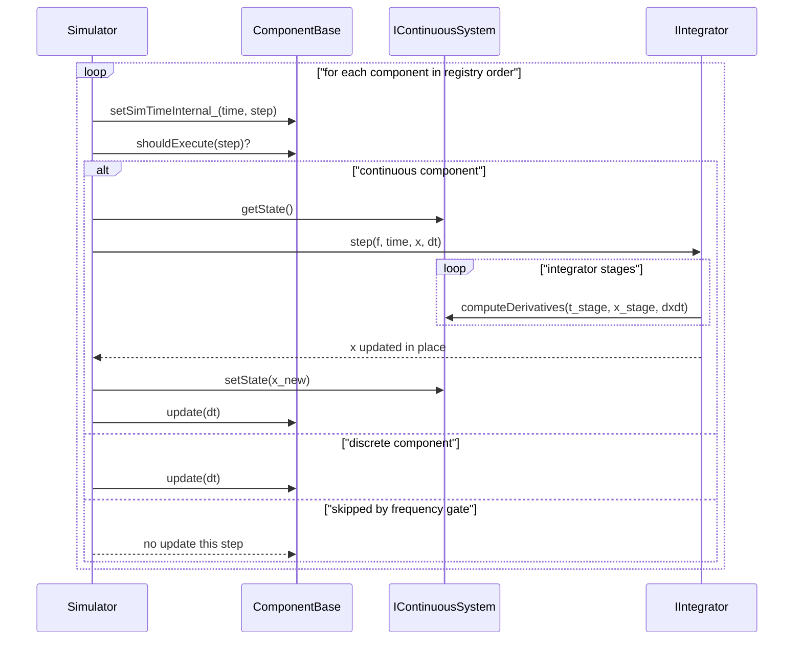

# Runtime Sequence

This page captures the current fixed-timestep runtime behavior after the
entity-first refactor.

## Full Lifecycle

## One Simulation Step

## Notes

- The simulation loop is fixed-timestep. `dt` stays equal to
  `simulation.dt` for callbacks, integration, logging, and stop-condition
  checks.
- Registry order matters for component updates. A guidance component should be
  declared before the dynamics component that consumes its command output.
- `AutoDataLogger` records after `Simulator::step()` and before
  `current_time += dt`.
